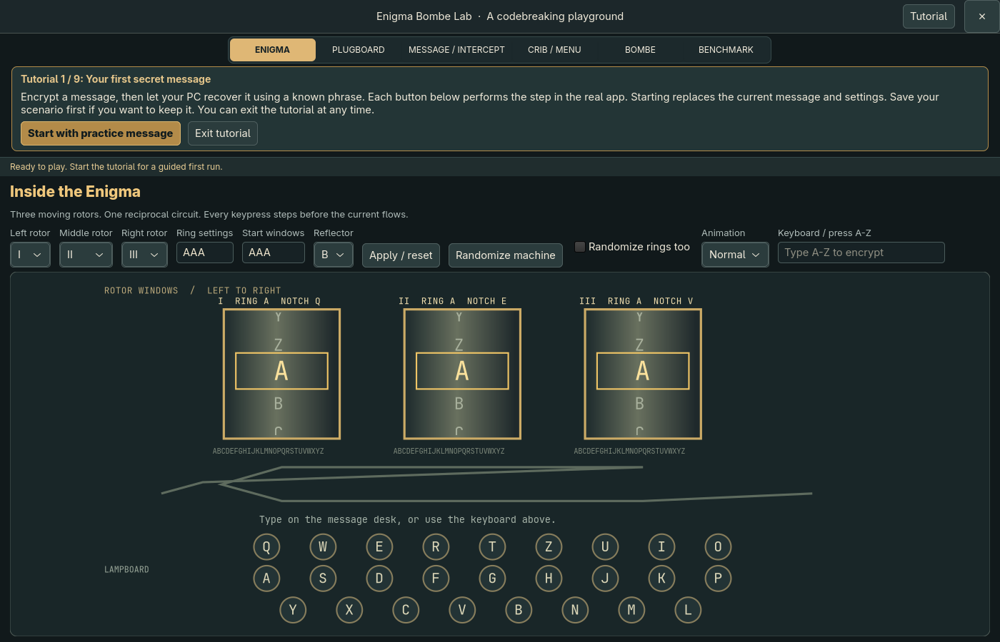
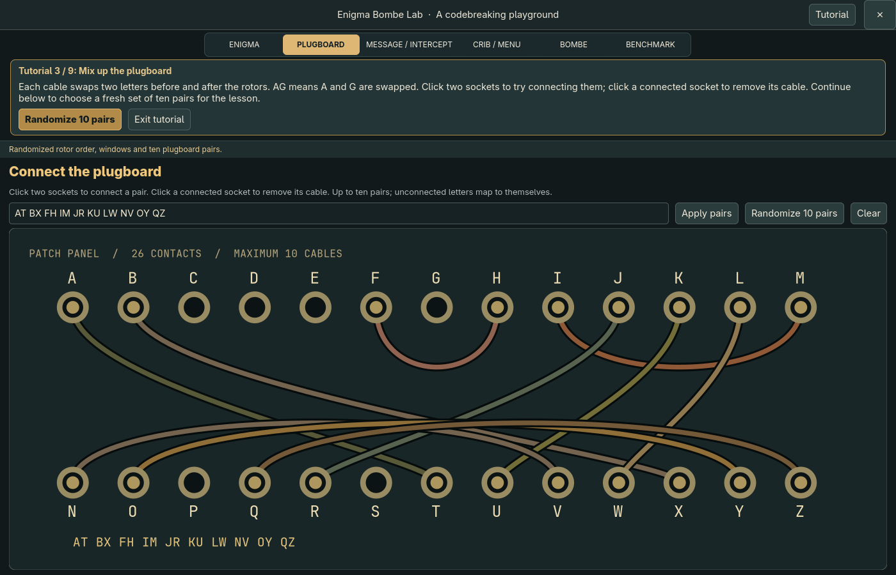
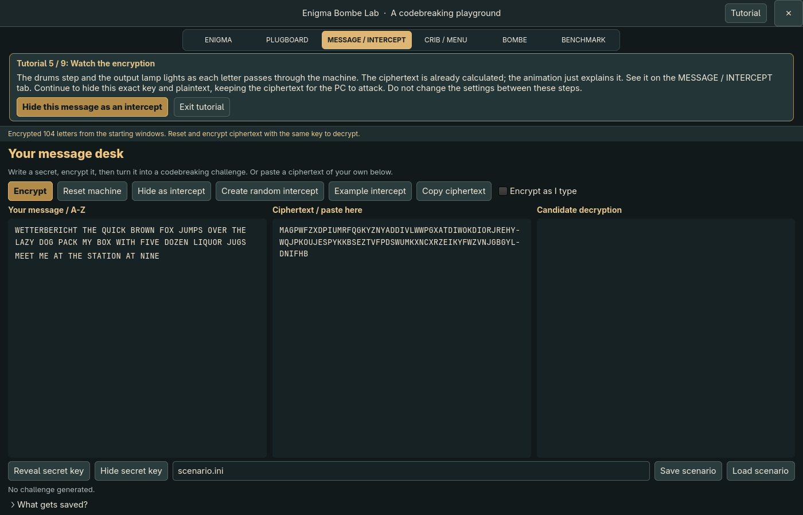
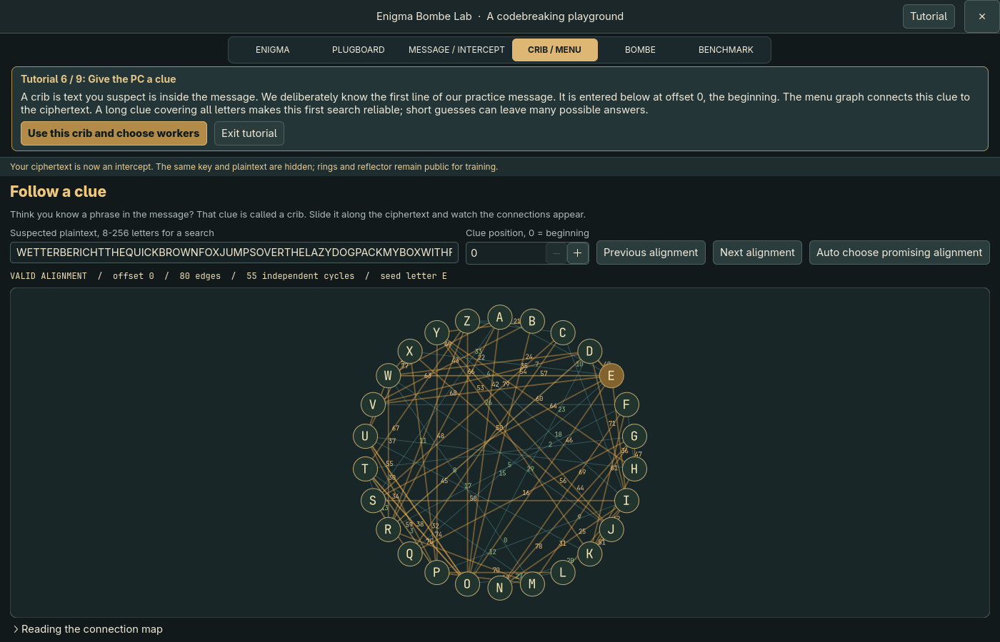
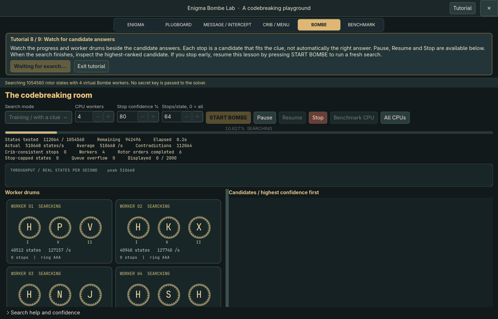
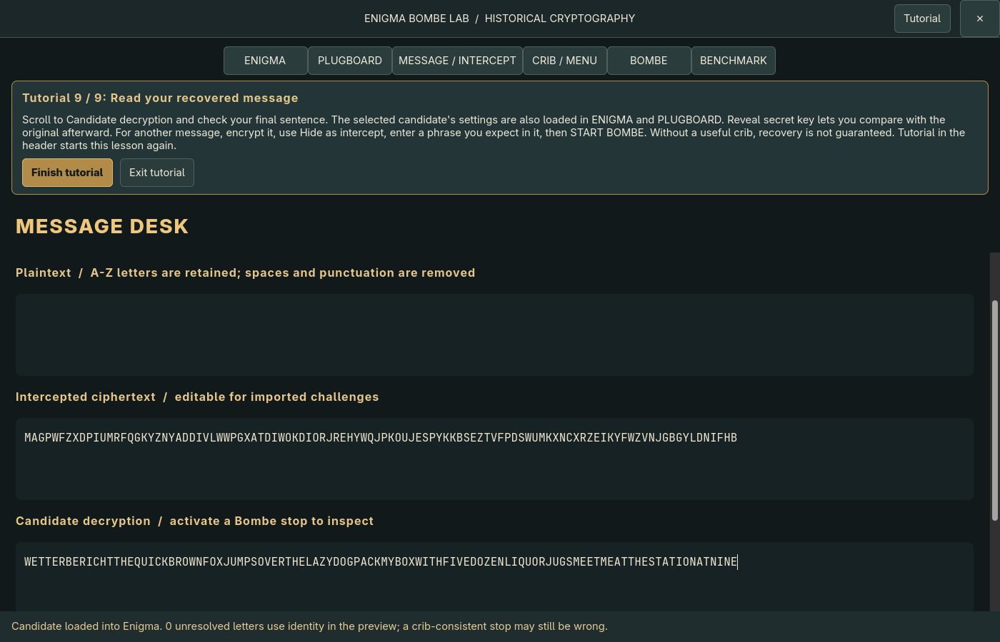

# Enigma Bombe Lab

Encrypt a message with an Enigma machine, then let your PC try to crack it. This is a Linux desktop app. Everything runs locally.

## Set up your PC

You need a Linux desktop and GTK 4.8 or newer. Install the build tools for your distribution.

**Ubuntu / Debian**

```sh
sudo apt update
sudo apt install build-essential meson ninja-build pkg-config libgtk-4-dev
```

**Fedora**

```sh
sudo dnf install gcc meson ninja-build pkgconf-pkg-config gtk4-devel
```

**Arch Linux**

```sh
sudo pacman -S --needed base-devel meson ninja pkgconf gtk4
```

Open a terminal in this project's folder, then build and start the tutorial:

```sh
meson setup build --buildtype=release
meson compile -C build
./build/enigma-bombe-lab --tutorial
```

If `build` already exists, skip the setup command and run the compile command again. Building and running do not need `sudo`.

## Use the app

### Start with the guided tutorial

Click **Tutorial** in the top-right corner, or launch with `--tutorial`. Follow the gold button in the tutorial panel. It takes you through nine steps in the actual app, from choosing a key to inspecting a candidate answer.

Starting the lesson replaces your current message and settings. Opening the tutorial does not. You can exit at any time and keep working with the current message.



### 1. Scramble the machine

On **ENIGMA**, click **Randomize machine**. This chooses the rotor order, starting letters and ten plugboard pairs. Leave **Randomize rings too** off for your first attempts, with Ringstellung **AAA** and reflector **B**.

On **PLUGBOARD**, the cables swap pairs of letters. You can click two sockets to connect them, click a connected socket to remove its cable, or use **Randomize 10 pairs**.



### 2. Encrypt your message

Open **MESSAGE / INTERCEPT** and enter text in **Your message**, then click **Encrypt**. The ciphertext appears in the adjacent editor. Only A-Z letters are kept; spaces and punctuation are removed. Open **ENIGMA** to watch the drums and lamps explain the encryption.

For the tutorial, keep its supplied first line and write your own final sentence. That first line gives the PC a strong clue for its first search.



Click **Hide as intercept** to hide this message and its key while preserving the ciphertext. The PC will try to recover it.

**Create random intercept** is different: it chooses a new key and encrypts your text again. Use **Hide as intercept** when you want to crack the exact message you just encrypted.

### 3. Give the PC a clue

Open **CRIB / MENU**. A *crib* is a phrase you think appears in the original message. Training and advanced modes need this clue. The no-crib mode below can attempt a search without it.

Enter the phrase and its **Offset**. Offset **0** means the phrase starts at the first letter, **1** at the second letter, and so on. Count letters after spaces and punctuation have been removed. The tutorial fills in its known first line at offset 0.



If you do not know the offset, use **Auto choose promising alignment** or try **Previous alignment** and **Next alignment**. Automatic alignment picks a promising position, not a guaranteed correct one. An alignment is impossible if any crib letter matches the ciphertext letter at the same position.

### 4. Start the search

Open **BOMBE**, choose **Training / with a clue**, and select **4** CPU workers to start. **All CPUs** uses all available logical CPUs, which may make the rest of your computer less responsive.

Click **START BOMBE**. The worker drums and candidate answers share the dashboard.
Drag the divider to give either pane more room. **Pause**, **Resume** and **Stop**
control the search.

**Stop confidence %** defaults to **80** in every search mode. When a candidate
reaches that English-confidence score, the workers stop, the best received candidate
is selected, and its text appears in **Candidate decryption**. Set the value to **0**
to disable automatic stopping. Saved scenarios remember this setting.

This threshold uses the same English-language estimate as the candidate list.
It does not prove that the message or key is correct, and it can stop on a wrong
answer. For non-English messages, disable it and inspect clue-based candidates.



Training mode knows the rings and reflector, and searches rotor order, starting letters and plugboard connections. It does not receive your hidden message or secret key.

### 5. Read the result

When candidates appear, double-click a row under **Candidates**, or select it and press Enter. The tutorial also provides **Inspect best candidate** after the search finishes.

Read **Candidate decryption** on **MESSAGE / INTERCEPT**. The candidate's settings are loaded into **ENIGMA** and **PLUGBOARD**. Use **Reveal secret key** afterward to compare with the original.



A stop means the candidate fits your clue. It may still be wrong. If the answer is incomplete or there are no stops, check the crib, offset, rings and reflector. Try a longer crib. The tutorial uses a deliberately long clue that covers the alphabet; a short real-world guess is harder.

### Try without a crib

Start with this ready-made English example:

```sh
./build/enigma-bombe-lab --threads 4 examples/no-crib.ini
```

On **BOMBE**, select **No crib / English detective** and click **START BOMBE**.
Leave the crib empty. Double-click the highest-scoring row to read its decryption.
Use **Stop** when you have a candidate to inspect. This example deliberately puts
the correct rotor state early in the search so you can try the workflow quickly.
It is not a timing benchmark for arbitrary messages.

For your own message, encrypt English text, choose **Hide as intercept**, then use
the same no-crib mode. It uses ciphertext and the supplied **rings and reflector**.
It ignores the crib, rotor order, starting-window and plugboard controls, and never
receives the hidden message or key. You can also paste ciphertext from elsewhere
and set the known rings and reflector on **ENIGMA**.

The search tries all 1,054,560 rotor states and improves plugboard guesses using
English letter statistics. **Attempts/state** controls how many
starting plugboards it tries. The first is empty; extra attempts use random plugs.
More attempts take longer. A full run can take hours; Pause, Resume and Stop work
while it runs. Results show improving guesses as they arrive. The default 80%
confidence target can stop the search early; set it to 0 for a full scan.

The minimum accepted input is **50 letters** after removing spaces and punctuation.
For a first puzzle, use **300–500 letters of ordinary English**. This is a
practical starting point, not an 80% confidence threshold. Short, repetitive,
non-English or unusual text can produce convincing wrong answers. Even completing
the rotor scan does not exhaust every plugboard.

Every candidate shows **English confidence**, a heuristic percentage calculated
only from its decrypted text. Higher values rank first. The app never compares
candidates against the stored original, even for demos or self-made challenges.
Read the full candidate message and decide for yourself.

The percentage measures English-language fit on a fixed display scale. It is not
a calibrated probability of recovering the correct message or settings. Hover a
row for the underlying score. See [the scale definition](docs/language-model.md).
The percentage is a guide to English resemblance.

### Encode a puzzle with Cryptii

Open [Cryptii's Enigma machine](https://cryptii.com/pipes/enigma-machine/) and
select **Encode**. Use these compatible settings for a first puzzle:

| Setting | Value |
| --- | --- |
| Model | Enigma M3 |
| Reflector | UKW B |
| Rotor 1 | V, position 1 / A, ring 1 / A |
| Rotor 2 | I, position 17 / Q, ring 1 / A |
| Rotor 3 | III, position 12 / L, ring 1 / A |
| Plugboard | `BQ CR DI EJ KW MT OS PX UZ GH` |
| Foreign chars | Ignore |

Choose any three different rotors from **I, II, III, IV and V**.

1. Enter your original message in Cryptii. For English detective, start with
   300–500 letters of ordinary English. Use A–Z text for predictable handling of
   spaces, punctuation and other characters.
2. Copy the resulting ciphertext into **Ciphertext / paste here** on this app's
   **MESSAGE / INTERCEPT** page. Leave **Your message** empty and do not click Encrypt.
3. On **ENIGMA**, set **Ring settings** to **AAA** and **Reflector** to **B**.
   The search discovers the rotor order, starting positions and plugboard, so
   you do not need to enter those.
4. For a search with a clue, enter an exact phrase of at least eight letters in
   **CRIB / MENU** and set its position. Position **0** means the beginning of the
   original message. Choose **Training / with a clue** on **BOMBE** and press
   **START BOMBE**. A longer exact phrase usually constrains more of the plugboard.
5. Without a clue, choose **No crib / English detective** instead. The minimum
   is 50 ciphertext letters. Read the candidate text when the confidence target
   stops the search; a high score alone does not establish the correct answer.

You can change the Cryptii ring settings, but supply the same letters to this app
for Training or English detective. For example, rings 5 / E, 23 / W, 23 / W mean
**EWW**. **Advanced / unknown rings** searches the rings too, requires a clue, and
takes much longer. Always copy fresh ciphertext after changing encryption settings.

**Auto choose promising alignment** picks one plausible clue position. It does
not locate the phrase or search all positions. If you know the phrase starts the
message, set position 0 yourself.

### When a pasted message will not start

Read the status message above the page content. Training and Advanced need a guessed
phrase of at least eight letters in **CRIB / MENU**, with a valid offset. **No crib /
English detective** requires at least 50 ciphertext letters. For a shorter intercept,
ask the sender for a clue or the machine settings.

**Reset machine** resets the Enigma display. To rerun a search, use **START BOMBE**;
if a search is still running, press **Stop** and wait for it to finish stopping first.
Repeating a search does not resolve missing input or an invalid clue.

### Come back later

On **MESSAGE / INTERCEPT**, enter a filename such as `my-message.ini` and click **Save scenario**. Use **Load scenario** to reopen it. Saved scenarios include the original key and plaintext, so they are not secret-free challenge files.

Useful launch commands:

```sh
# Open the app normally
./build/enigma-bombe-lab

# Repeat the tutorial
./build/enigma-bombe-lab --tutorial

# Open a ready-made challenge, then press START BOMBE
./build/enigma-bombe-lab --threads 4 examples/training.ini

# Measure your CPU's search speed
./build/enigma-bombe-lab --benchmark
```

To check the build:

```sh
meson test -C build --print-errorlogs
```

The tutorial test opens a window and runs a real recovery. It skips itself when no graphical display is available. Technical details, solver limitations and development notes are in [docs/development.md](docs/development.md).
